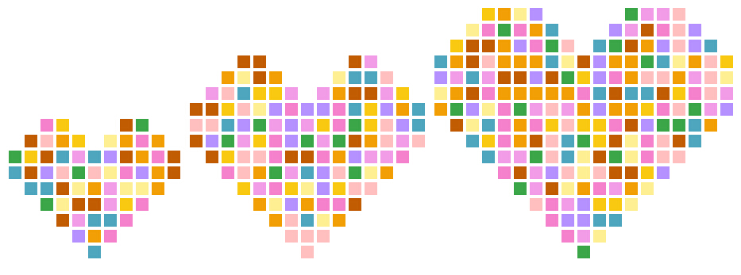
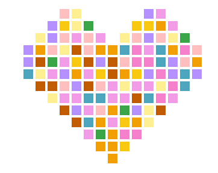
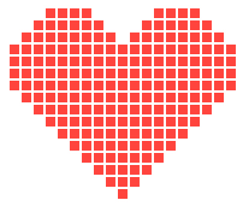

Heart
=====

A simple JS tool to draw a heart shape.

该工具非常简单，就是在指定的容器内绘制心形

效果如下图：

示例
=====

html

	

js

	var heart = new Heart();
	heart.init();

此时，绘制出来的效果为demo图里中间的那个心形。

当然，还可以通过传入配置来改变心形的大小和颜色。

	var opt = {
			parentId: "big",//容器id
			triangleH: 10,  //底部三角形的高，通过它来控制心形的大小
			color: [		//颜色值，随机取，数组长度为1时为单一颜色
				"#FF443E"
			]
	};

效果如下：

[查看demo](http://helloiamkitty.github.io/make-love/)